# Step 2: CKEditor AI, AI Automators and field widget actions

**Goal:** editors get AI help while they write. You add an AI menu to the text editor,
let AI fill fields from the page content, give editors buttons that run AI on demand,
and let AI describe, tag and write alt text for images.

**Before you start:** you have finished [step 1](01_setup.md). If you have not, reset
your site to the end of step 1:

```bash
git checkout 01_setup
ddev catch-up
```

To skip this step and see the result, check out the branch of this step and catch up:

```bash
git checkout 02_automators_ckeditor
ddev catch-up
```

All examples use the **Utility page** content type and the Northmoor pages from step 1.

## 1. Enable the modules

```bash
ddev drush pm:install ai_ckeditor ai_automators field_widget_actions
```

| Module | Project | What it does |
|---|---|---|
| AI CKEditor (`ai_ckeditor`) | [AI CKEditor](https://www.drupal.org/project/ai_ckeditor) | Adds an AI menu to CKEditor 5. |
| AI Automators (`ai_automators`) | [AI](https://www.drupal.org/project/ai) (submodule) | Fills fields with AI, based on other fields. |
| Field Widget Actions (`field_widget_actions`) | [Field Widget Actions](https://www.drupal.org/project/field_widget_actions) | Adds buttons to form fields. The module is a generic framework; the AI buttons come from AI Automators and other modules. |

AI CKEditor and Field Widget Actions used to be part of the AI project. They are now
separate projects. The AI project still contains old copies with the same names, but
Drupal enables the separate projects.

## 2. CKEditor AI

**Module:** AI CKEditor (`ai_ckeditor`), from the separate
[AI CKEditor](https://www.drupal.org/project/ai_ckeditor) project.

CKEditor AI adds an **AI Assistant** menu to the text editor. Editors select text and
let the AI rewrite, summarize or correct it, or they let the AI write new text. The
result is shown in a dialog first, so the editor decides what goes into the page.

### Add the AI button to the editor

1. Go to **Configuration › Content authoring › Text formats and editors** and configure
   the [Content](https://drupal-ai-workshop.ddev.site/admin/config/content/formats/manage/content_format)
   text format.
2. Under **Toolbar configuration**, move the **AI CKEditor** button (the first button in
   **Available buttons**) into the **Active toolbar**. Place it at the start, so it does
   not end up in the overflow menu. You can drag it with the mouse, or select it and use
   the arrow keys: ↓ adds it to the toolbar, ← moves it to the left.

   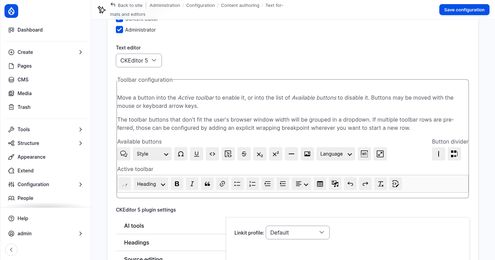

3. Under **CKEditor 5 plugin settings**, open the **AI tools** tab. Enable these tools:

   | Tool | What it does |
   |---|---|
   | Generate with AI | Writes new text from your instructions. |
   | Modify with a prompt | Changes the selected text with your instructions. |
   | Fix spelling | Corrects spelling and punctuation, without changing the style. |
   | Summarize | Summarizes the selected text. |

   Each tool has an **AI provider** setting. Keep the preselected chat model.

   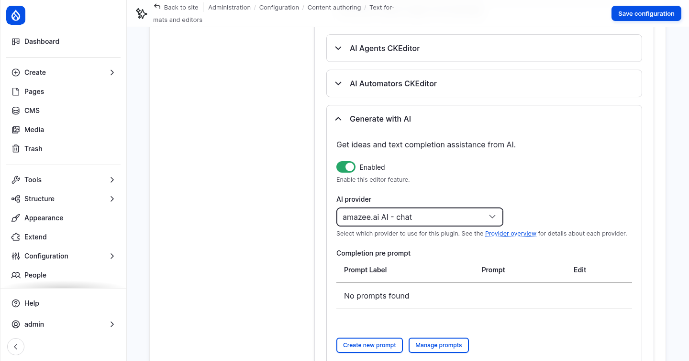

   The other tools need more setup. **Tone** and **Translate** take their options (the
   tones, the languages) from a taxonomy vocabulary. **AI Agents CKEditor** and **AI
   Automators CKEditor** connect the editor to agents and automator chains.

4. Click **Save configuration**.

Only users with the permission **Use AI CKEditor plugin** can use the menu. Administrators have
every permission. Give it to content editors too, on the
[AI CKEditor permissions](https://drupal-ai-workshop.ddev.site/admin/people/permissions/module/ai_ckeditor)
page, or with:

```bash
ddev drush role:perm:add content_editor 'use ai ckeditor'
```

### Use the AI menu

1. Open the page [About Northmoor](https://drupal-ai-workshop.ddev.site/about) and click **Edit**.
   If Drupal asks about a draft from an earlier visit, click **Discard**.
2. In **Content**, select the first paragraph.
3. Open **AI Assistant** in the toolbar and choose **Modify with a prompt**.

   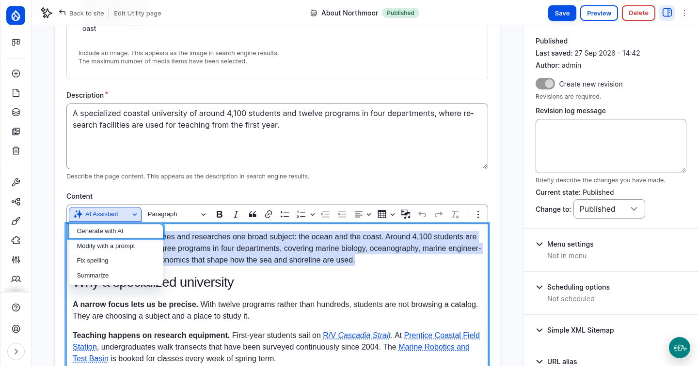

4. In **Your instructions**, enter:

   > Rewrite this paragraph in a friendly, welcoming tone for prospective students.

5. Click **Modify text**. The answer appears in **Response from AI**. You can edit it
   there. Click **Save changes to editor** to replace the selected text.

   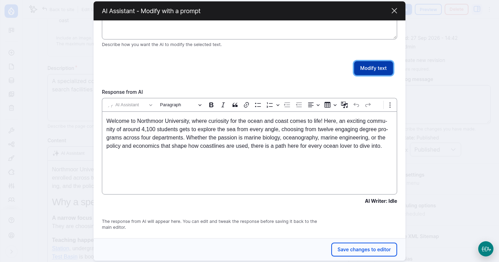

Then try the other tools:

- Put the cursor at the end of the text, choose **Generate with AI** and ask for a short
  paragraph about visiting the campus in winter.
- Type a sentence with spelling mistakes, select it and choose **Fix spelling**.
- Select a long section and choose **Summarize**.

You do not need to save the page. Leave it without saving if you want to keep the
original text.

### Where the prompts are

Every tool sends a prompt to the AI, together with the selected text and your
instructions. The prompts are editable. Go to **Configuration › AI Setup and
Configuration ›** [AI Prompts](https://drupal-ai-workshop.ddev.site/admin/config/ai/prompts).
The prompts `ai_ckeditor_*__default` belong to the CKEditor tools. The **AI Prompt
Types** tab shows which variables each prompt can use, such as `{inputText}`.

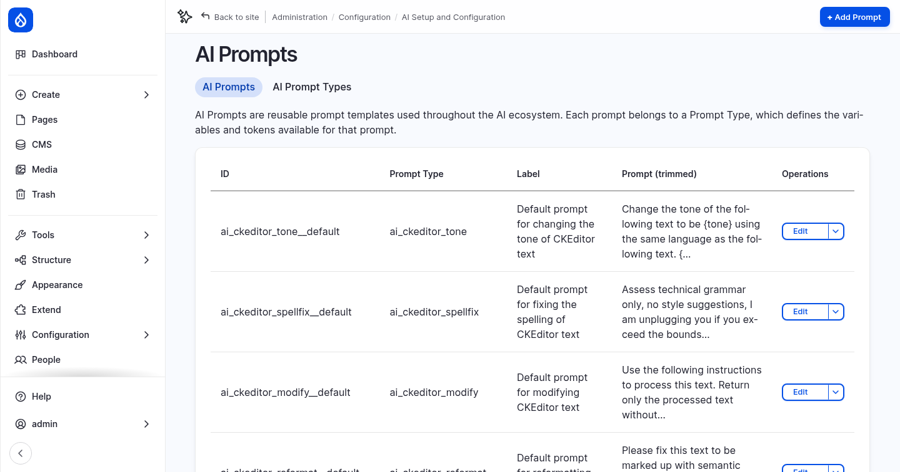

Open [AI Logs](https://drupal-ai-workshop.ddev.site/admin/config/ai/logging/collection)
to see the full request that CKEditor sent. It is tagged `ai_ckeditor`.

## 3. AI Automators

**Module:** AI Automators (`ai_automators`), a submodule of the AI project.

An automator fills a field with AI. You attach it to a field and tell it where the input
comes from (usually another field on the same entity) and what to do with it. Automators
exist for almost every field type: text, taxonomy terms, images, links, numbers and
more.

### A first automator: the page description

The **Description** field of the Utility page is used as the teaser and as the
description for search engines. We let the AI write it from the page content.

1. Go to **Structure › Content types › Utility page › Manage fields** and edit
   [Description](https://drupal-ai-workshop.ddev.site/admin/structure/types/manage/page/fields/node.page.field_description).
2. Check **Enable AI Automator**, and fill in:

   | Setting | Value |
   |---|---|
   | Choose AI Automator Type | **LLM: Text (simple)** |
   | Automator Input Mode | **Base Mode** |
   | Automator Base Field | **Content** |
   | Automator Prompt | see below |

   Prompt:

   ```
   Summarize the following page text in one or two sentences of at most 250 characters. The summary is used as a teaser for the page. Return only the summary, without quotes or explanations.

   {{ context }}
   ```

   `{{ context }}` is replaced with the text of the base field, without HTML. Open
   **Placeholders available** to see all placeholders.

   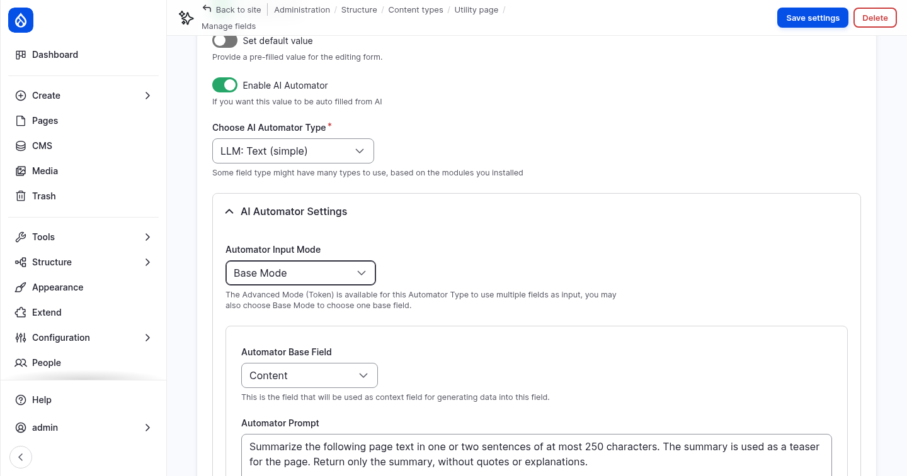

3. Open **Advanced Settings**:
   - Under **Automator Label**, enter `Description from content`. The label is shown
     when you pick the automator for a button in the next section.
   - Under **Automator Worker**, choose **Field Widget**.

   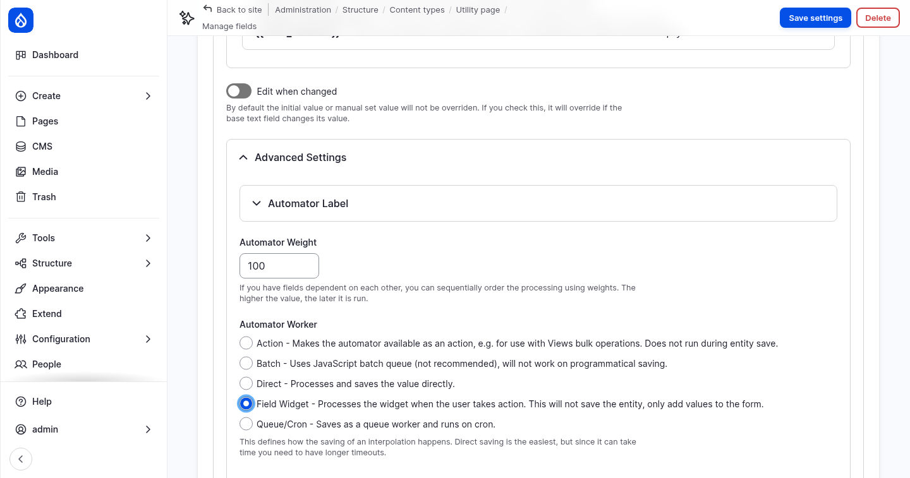

4. Click **Save settings**.

### The automator settings explained

**Automator types.** The list depends on the field type. For a plain long text field
you can choose:
- **LLM: Text (simple):** one prompt, one answer.
- **LLM: Text:** can return several values.
- **Summarize:** uses the summarize operation of the AI provider.

**Input mode.**
- **Base Mode** uses one field as input, as `{{ context }}` in the prompt.
- **Advanced Mode (Token)** builds the prompt from tokens instead, such as `[node:title]`
  and `[node:field_content]`, so it can combine several fields.

**Edit when changed.** By default an automator only fills an empty field. With this
option, it also overwrites the value when the base field changes.

**Automator Weight.** When one automator uses the result of another, the weight sets the
order: higher weights run later.

**Automator Worker.** This decides *when* the automator runs:

| Worker | When it runs |
|---|---|
| Direct | When the entity is saved. The value is saved directly. |
| Field Widget | When the editor clicks a button next to the field. It only fills the form and does not save. |
| Queue/Cron | Later, in a queue that runs on cron. Useful for slow requests or many entities. |
| Batch | In a JavaScript batch after saving. Not recommended; it does not run when content is saved by code. |
| Action | Only as an action, for example as a bulk operation in a content view. |

We use **Field Widget** for the description, because the field is **required**. Drupal
does not save the form while a required field is empty, so an automator that runs on
save would come too late. With a button, the editor fills the field before saving, and
can review and change the text.

**AI Provider.** By default, automators use the default model for *chat with complex
JSON* from the AI settings. You can pick a specific provider and model per automator.

**Guardrail set.** An automator can use a guardrail set, for example the *Workshop
security* set from step 1. Input and output are then checked, and a blocked run leaves
the field unchanged.

All automators are listed under **Configuration › AI Setup and Configuration › AI
Automators ›** [AI Automator Configuration](https://drupal-ai-workshop.ddev.site/admin/config/ai/ai-automators/ai-automator).

## 4. Field widget actions

**Modules:** Field Widget Actions (`field_widget_actions`), from the separate
[Field Widget Actions](https://www.drupal.org/project/field_widget_actions) project,
provides the buttons. The **Automator Text Suggestion** action comes from AI Automators
(`ai_automators`).

A field widget action is a button next to a form field. An AI action button runs an
automator and puts the result into the field, without saving the entity.

### Add a button to the Description field

1. Go to **Structure › Content types › Utility page ›**
   [Manage form display](https://drupal-ai-workshop.ddev.site/admin/structure/types/manage/page/form-display).
2. Click the gear icon of the **Description** field to open its widget settings, then
   open **Field Widget Actions**.
3. In **Add New Action**, choose **Automator Text Suggestion** and click **Add action**.
   The list only shows actions that fit the field type and widget. The automator action
   only appears when the field has an automator.

   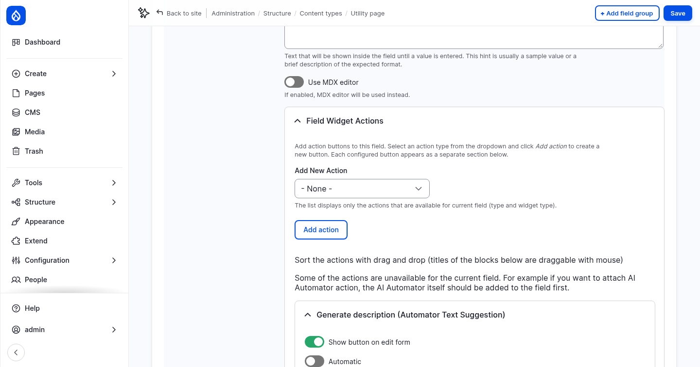

4. Configure the new action:

   | Setting | Value |
   |---|---|
   | Show button on edit form | On |
   | Button label | `Generate description` |
   | Enable an Automator › Automator to use for suggestions | **Description from content** |

   Two more options are worth knowing:
   - **Automatic** runs the action when the form loads, without a click.
   - **Enable interactive refinement** shows the result in a dialog, where the editor
     can refine it with more instructions before inserting it.

   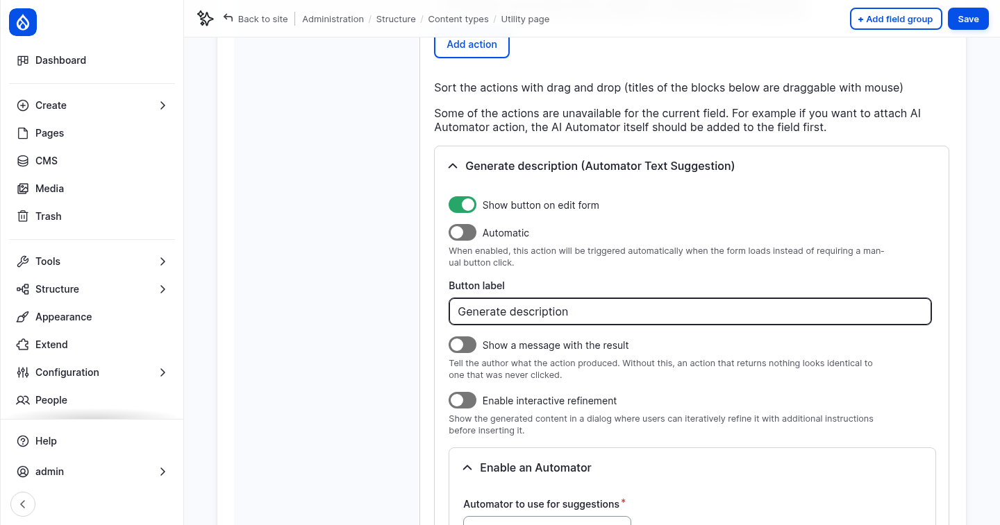

5. Click **Update**, then **Save**.

### Use the button

1. Open the page [About Northmoor](https://drupal-ai-workshop.ddev.site/about) and click **Edit**.
2. Clear the **Description** field.
3. Click **Generate description**. After a few seconds, the field contains a new
   summary of the page content.

   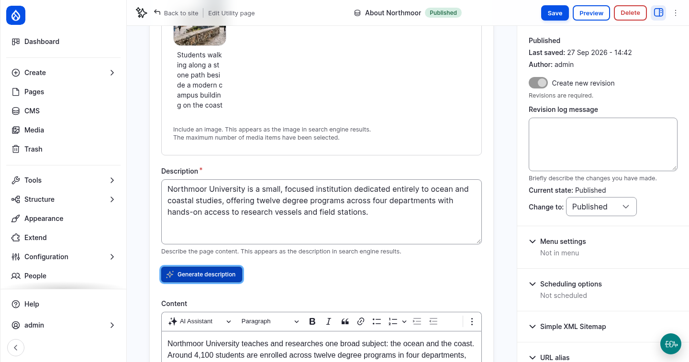

The page is not saved yet. Review the text, change it if needed, then save the page, or
leave without saving.

Field widget actions exist for many field types: alt text for images, taxonomy terms,
images generated from text, links, numbers and more. Other modules can add their own
actions.

## 5. An automator that runs on save: tags

The Tags field is empty on all pages. This automator adds tags whenever a page is saved,
with no button.

1. Edit the field [Tags](https://drupal-ai-workshop.ddev.site/admin/structure/types/manage/page/fields/node.page.field_tags)
   of the Utility page, and check **Enable AI Automator**:

   | Setting | Value |
   |---|---|
   | Choose AI Automator Type | **LLM: Taxonomy** |
   | Automator Input Mode | **Base Mode** |
   | Automator Base Field | **Content** |
   | Automator Prompt | see below |
   | Advanced Settings › Automator Label | `Tags from content` |
   | Advanced Settings › Automator Worker | **Direct** |
   | Advanced Settings › Find similar tags | **Off** |

   Prompt:

   ```
   Choose up to 5 short tags (one to three words each) that describe the main topics of the page text below. Reuse existing tags when they fit. Existing tags: {{ value_options_comma }}

   Page text:
   {{ context }}
   ```

   `{{ value_options_comma }}` lists the existing terms of the vocabulary. The Tags field
   allows new terms to be created, so the automator can add new tags.

   Leave **Find similar tags** off. It asks the AI in a second request whether a new tag
   is almost the same as an existing one. When the AI finds none, it correctly answers
   with an empty list, but the current version of AI Automators does not accept that
   answer. The automator then fails, the page is saved without tags, and the log shows
   *The response was not a valid JSON response. The response was: []*.

   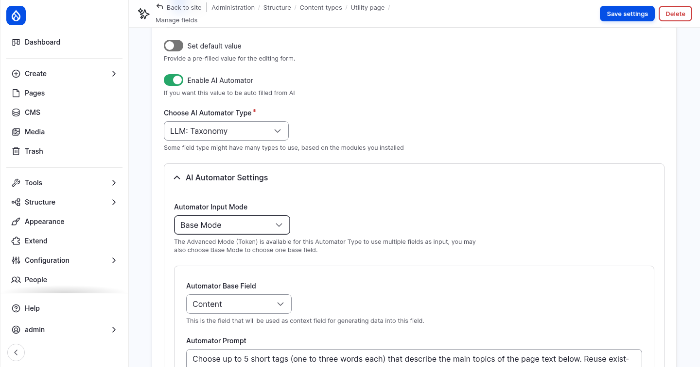

2. Click **Save settings**.
3. Open the page [BS in Marine Biology](https://drupal-ai-workshop.ddev.site/bs-marine-biology), click **Edit**,
   and click **Save** without changing anything.
4. Edit the page again. The **Tags** field now contains tags that the AI chose.

   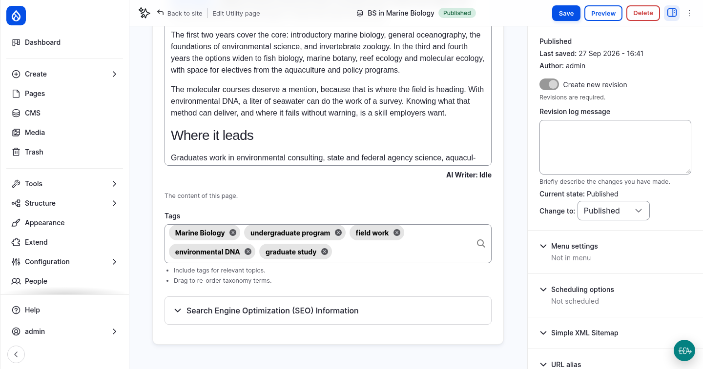

The automator only runs when the Tags field is empty. Saving takes a little longer,
because Drupal waits for the AI.

Open [AI Logs](https://drupal-ai-workshop.ddev.site/admin/config/ai/logging/collection)
again. The automator requests are tagged with the automator, the entity and the field,
for example `ai_automator:id:node.page.field_tags.default`.

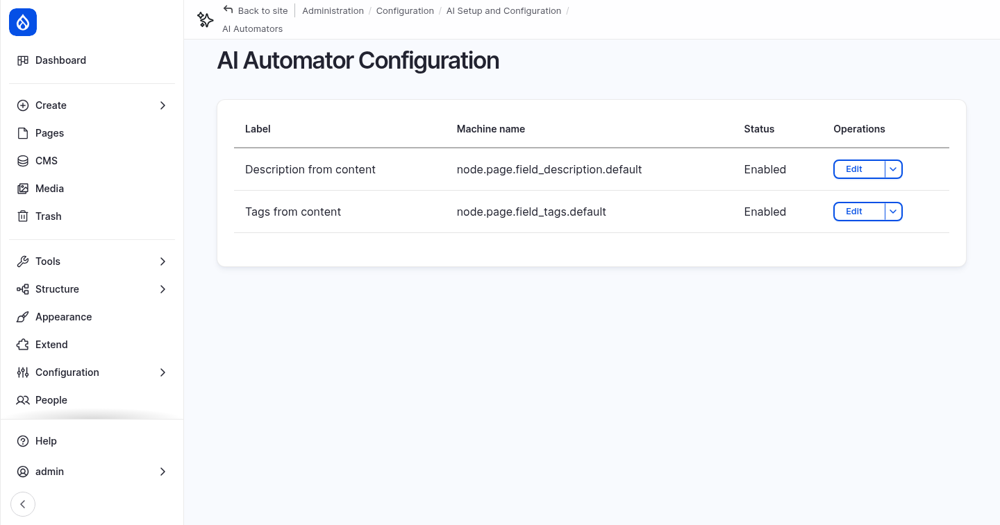

### More to try

- Add an **Automator Taxonomy** button to the Tags field. The Tags field uses the Tagify
  widget, which supports this action. It works well next to the automator that runs
  on save.
- Add automators to **SEO title** and **SEO description** in **Advanced Mode (Token)**,
  with a prompt like: *Write a page title of at most 60 characters for search engines,
  based on [node:title] and [node:field_content]. Return only the title.* Give them a
  button each.
- Attach the **Workshop security** guardrail set to an automator and try to trigger it
  with page content.

## 6. Images: alt text and image classification

**Recipes:** [AI Image Alternative Text](https://www.drupal.org/project/ai_recipe_image_alt_text)
(`ai_recipe_image_alt_text`) and
[AI Image Classification](https://www.drupal.org/project/ai_recipe_image_classification)
(`ai_recipe_image_classification`). They are separate projects. They do not add new
features; they configure AI Automators and Field Widget Actions, the modules you just
used, for the **Image** media type. The classification recipe also installs
[Views Bulk Operations](https://www.drupal.org/project/views_bulk_operations).

You apply them and then look at what they configured, instead of building it by hand.

### Apply the recipes

```bash
ddev drush recipe ../recipes/ai_recipe_image_alt_text
ddev drush recipe ../recipes/ai_recipe_image_classification
```

The recipes add to the Image media type:

| Field | Automator | Model | Worker |
|---|---|---|---|
| Alternative text (of `field_media_image`) | *Image Vision* (`llm_image_alt_text`) | Default vision model | Field Widget: a **Generate Alt Text** button |
| Image Description (`field_image_description`, new) | *Image Description Default* (`llm_simple_string_long`) | Default vision model | Direct: on save |
| Image Tags (`field_image_tags`, new, vocabulary *Image Classification*) | *Image Tags Default* (`llm_taxonomy`) | Default JSON model | Direct: on save, after the description |

**Turn off Find similar tags for Image Tags.** The recipe switches on *Find similar
tags* for the two Image Tags automators. It fails in the same way as described for the
page tags above. Turn it off:

```bash
ddev drush config:set ai_automators.ai_automator.media.image.field_image_tags.default plugin_config.automator_search_similar_tags 0 -y
ddev drush config:set ai_automators.ai_automator.media.image.field_image_tags.action plugin_config.automator_search_similar_tags 0 -y
```

For the first one you can also uncheck **Find similar tags** in the settings of the
[Image Tags field](https://drupal-ai-workshop.ddev.site/admin/structure/media/manage/image/fields/media.image.field_image_tags).
The second one, for bulk actions, has no form for this setting.

They also add:
- **Two more automators**, *Image Description Action* and *Image Tags Action*, with the
  **Action** worker. They run as bulk actions on existing images.
- **Two bulk actions** in the [media list](https://drupal-ai-workshop.ddev.site/admin/content/media): *AI: Image
  Description* and *AI: Image Tags*.
- **Filters** for description and tags in the media list and the media library.

Open [AI Automator Configuration](https://drupal-ai-workshop.ddev.site/admin/config/ai/ai-automators/ai-automator) to
see the new automators, and open them to read their prompts:

- **Image Vision** uses token mode, with the language of the media item
  (`[media:language:name]`), and asks for an accessible alt text under 100 characters.
- **Image Description Default** asks for a detailed description (colours, style, people,
  objects) for search. The model receives the image itself; it is a *vision* request.
- **Image Tags Default** uses base mode, with **Image Description** as the base field. It
  does not look at the image, but classifies the text description. That is why its
  weight is 101: it runs after the description automator (weight 100).

### Generate alt text

1. Go to the [media list](https://drupal-ai-workshop.ddev.site/admin/content/media) and edit the image *A research vessel
   leaving the harbour at dawn*.
2. Clear **Alternative text** and click **Generate Alt Text**. The AI looks at the image
   and writes a new alt text.

   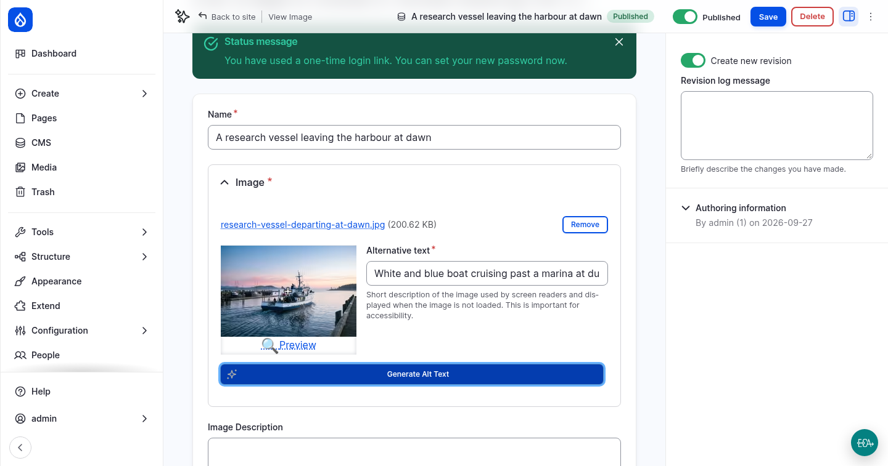

### Describe and tag an image on save

**Image Description** and **Image Tags** are empty. Click **Save**. The two automators
that run on save fill them in. Saving takes a few seconds longer. Then edit the image
again:

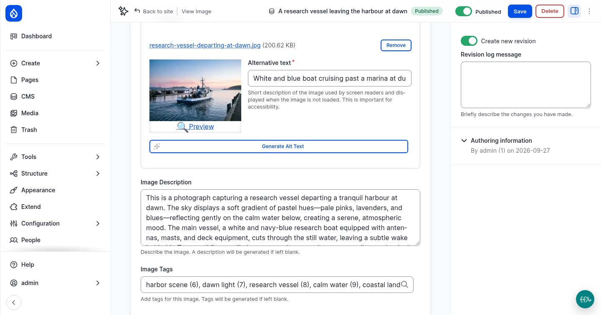

The field help says so too: *A description will be generated if left blank.* Every new
image that editors upload is described and tagged this way.

### Classify existing images in bulk

The other 19 images were created before the automators existed. Classify them with the
bulk actions:

1. In the [media list](https://drupal-ai-workshop.ddev.site/admin/content/media), select a few images (three to five are
   enough; each one is an AI request).
2. In **Action**, choose **AI: Image Description** and click **Apply to selected
   items**.

   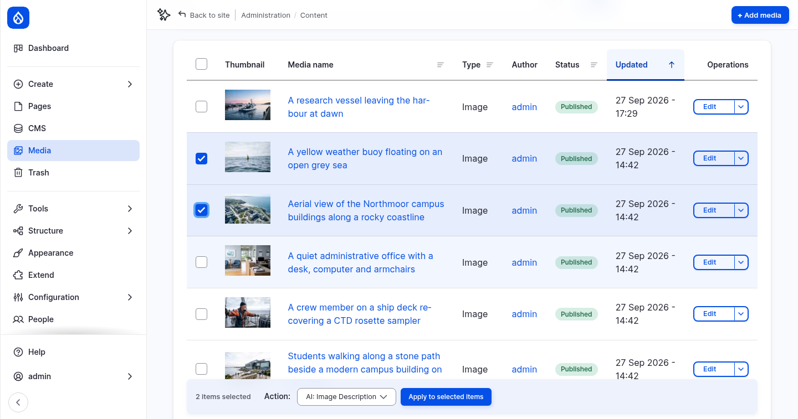

3. Select the same images again, choose **AI: Image Tags** and apply. The tags are
   based on the description, so run the description first.

### Find images by description and tags

Open the [media library grid](https://drupal-ai-workshop.ddev.site/admin/content/media-grid). It now has **Description**
and **Tags** filters. Search for `harbour` in **Description**. The filter searches the
text that the AI wrote, so it finds images by what they show, not only by their name.

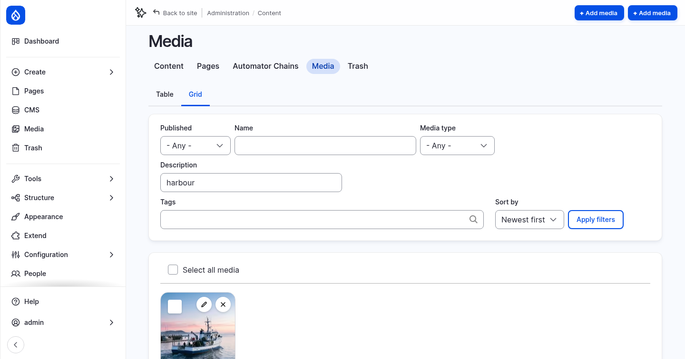

The same filters are in the media library dialog that editors use to pick an image for a
page. The tags are terms in the **Image Classification** vocabulary, which starts empty
and grows as images are tagged.

## Checkpoint

You now have:

- an **AI Assistant** menu in the text editor, with four tools
- an automator for the Description field, and a **Generate description** button that
  runs it
- an automator that adds tags to a page when it is saved
- a **Generate Alt Text** button for images, and images that are described and tagged
  on save or in bulk

If something does not work, reset your site to the end of this step:

```bash
git checkout 02_automators_ckeditor
ddev catch-up
```
