# Step 3: AI Search and AI Answers

**Goal:** visitors ask a question in their own words and get an answer written from the
Northmoor pages, with the source pages listed. You index the site content in a vector
database, look at how search by meaning works, and build an **Ask Northmoor** page.

**Before you start:** this step adds new Composer packages. Check out the branch of this
step and install them:

```bash
git checkout 03_ai_search
ddev composer install
ddev drush cache:rebuild
```

Then:

- to do this step yourself, continue with your site from [step 2](02_automators_ckeditor.md);
- to skip to the result of this step, run `ddev catch-up`.

## 1. How AI Answers works

A normal search finds pages that contain the words you typed. AI Search finds text that
has the same **meaning**, even when it uses other words. AI Answers then lets an AI write
an answer from that text.

- **Embeddings.** An embeddings model turns a piece of text into a long list of numbers
  (a *vector*). Texts with a similar meaning get similar vectors. Try it in the
  [Embeddings Explorer](https://drupal-ai-workshop.ddev.site/admin/config/ai/explorers/embeddings_generator).
- **Chunks.** Pages are too long for one vector, so each page is split into chunks of a
  few hundred tokens. Each chunk gets its own vector.
- **Vector database.** The vectors are stored in a database that can find the vectors
  nearest to a question. Here, that is PostgreSQL with the *pgvector* extension, which
  runs as the `postgres` service in DDEV.
- **RAG** (retrieval-augmented generation). The question is turned into a vector, the
  best matching chunks are retrieved, and the AI writes the answer from those chunks
  only.

```
Question ─► AI agent ─► RAG search tool ─► vector database (chunks of the Northmoor pages)
                ▲                                   │
                └──────── best matching chunks ◄────┘
                │
                ▼
      Answer with [1] [2] citations  +  list of sources
```

## 2. Apply the recipe

**Recipe:** [AI Answers](https://www.drupal.org/project/ai_recipe_answers)
(`ai_recipe_answers`). It applies two more recipes:
[AI Vector DB Provider for Postgres](https://www.drupal.org/project/ai_recipe_vdb_provider_postgres)
and [AI Content Search Vector](https://www.drupal.org/project/ai_recipe_content_search_vector).

```bash
ddev drush recipe ../recipes/ai_recipe_answers
```

| Module | Project | What it does |
|---|---|---|
| Search API (`search_api`) | [Search API](https://www.drupal.org/project/search_api) | The search framework: servers, indexes, indexing. |
| AI Search (`ai_search`) | [AI Search](https://www.drupal.org/project/ai_search) | A Search API backend that stores content as vectors, and the *RAG/Vector Search* tool. It used to be part of the AI project; the copy there is deprecated. |
| Postgres VDB Provider (`ai_vdb_provider_postgres`) | [Postgres VDB Provider](https://www.drupal.org/project/ai_vdb_provider_postgres) | Connects AI Search to PostgreSQL with pgvector. |
| AI Agents (`ai_agents`) | [AI Agents](https://www.drupal.org/project/ai_agents) | The agent that searches and writes the answer. Already installed in step 1. |
| AI Answers (`ai_answers`) | [AI Answers](https://www.drupal.org/project/ai_answers) | The question, answer and sources blocks, and the answer service behind them. |

The recipes create:

- the connection to the vector database, with the DDEV settings (host `postgres`,
  database `default`, user `vectordb`);
- the Search API **server** *Content Vector*, which stores vectors in PostgreSQL;
- the Search API **index** *Content Vector*, for all pages;
- the view mode **Search index**, which decides how a page is rendered for indexing;
- the agent **Content Search Agent**, and the AI Answers settings for it.

## 3. Look at the configuration

### The embeddings model

In [AI Settings](https://drupal-ai-workshop.ddev.site/admin/config/ai/settings), the
default for **Embeddings** is amazee.ai with the model `embeddings`. The recipe uses
this default for the server.

### The server

Go to **Configuration › Search and metadata ›**
[Search API](https://drupal-ai-workshop.ddev.site/admin/config/search/search-api).

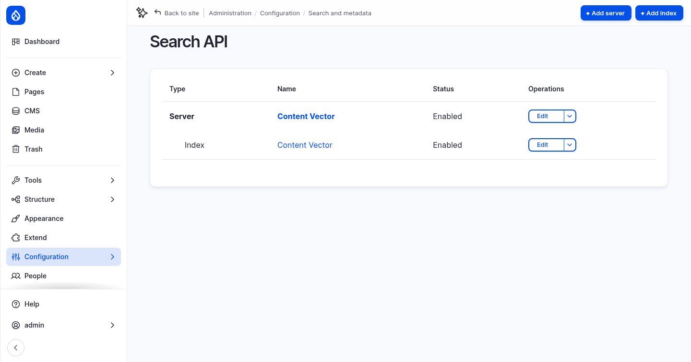

Edit the [Content Vector server](https://drupal-ai-workshop.ddev.site/admin/config/search/search-api/server/content_vector/edit):

- **Backend:** *AI Search*, which indexes items in a vector database.
- **Embeddings Engine:** amazee.ai `embeddings`, with **1024 dimensions**. Every chunk
  and every question gets a vector of this length. Changing the engine means indexing
  everything again.
- **Vector Database:** *Postgres*, database `default`, collection
  `content_database_index`, similarity metric *cosine similarity*.

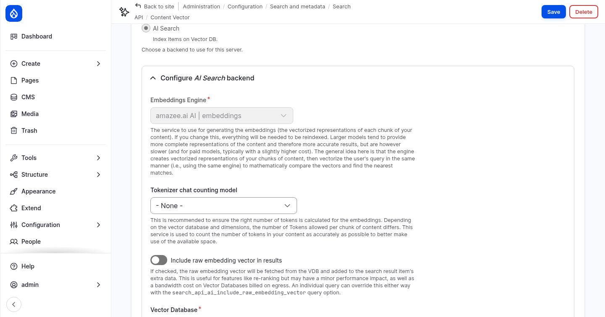

- **Advanced Embeddings Strategy Configuration:** *Enriched Embedding Strategy* splits
  every page into chunks of **300** tokens with **100** tokens of overlap. It adds
  contextual content (such as the title) to each chunk, up to 30% of the chunk.

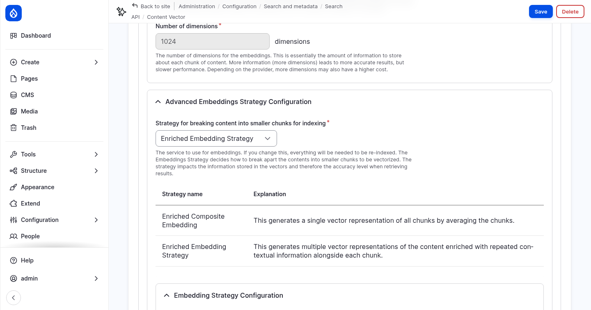

### The index

Open the [fields of the Content Vector index](https://drupal-ai-workshop.ddev.site/admin/config/search/search-api/index/content_vector/fields).
The **Indexing option** of each field decides its role in the vector database:

| Indexing option | Meaning | Fields in this index |
|---|---|---|
| Main content | Split into chunks; questions are matched against it. | **Rendered HTML output** (the page rendered in the *Search index* view mode) |
| Contextual content | Added to every chunk, so a chunk keeps its context. | **Title**, **URI** |
| Filterable attributes | Stored with the chunk for filtering, not embedded. | none |

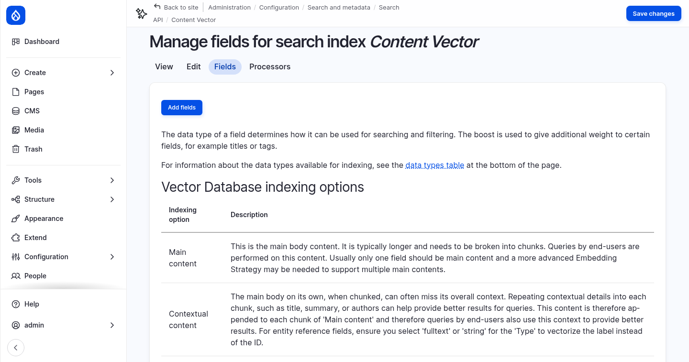

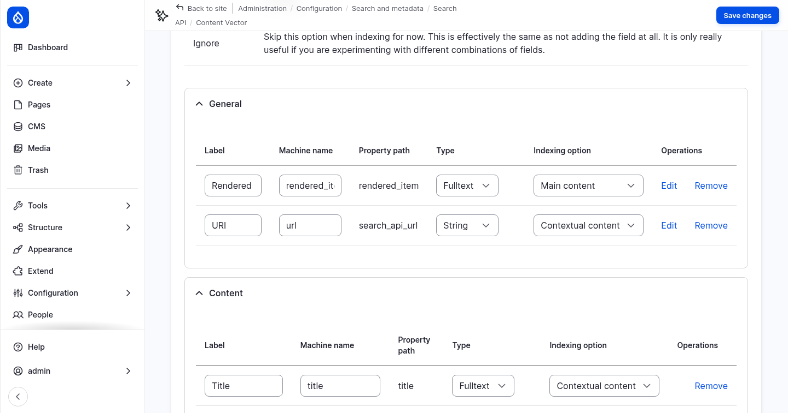

## 4. Index the content

The index is empty. Index all pages:

```bash
ddev drush search-api:index content_vector
```

You can also click **Index now** on the
[index page](https://drupal-ai-workshop.ddev.site/admin/config/search/search-api/index/content_vector).
Every page is sent to the embeddings model, so this takes a few seconds. New and changed
pages are indexed when they are saved.

Look at the chunks in PostgreSQL:

```bash
ddev exec -s postgres psql -U vectordb -d default -c "select count(*) from content_database_index"
ddev exec -s postgres psql -U vectordb -d default -c "select drupal_long_id, left(regexp_replace(content, '\s+', ' ', 'g'), 70) as chunk from content_database_index order by drupal_long_id limit 5"
```

The 21 pages become a little more than 100 chunks. `drupal_long_id` shows the page and
the number of the chunk, for example `entity:node/10:en:2` is the third chunk of node 10.

## 5. Test the search in the AI Explorer

You can test search by meaning before any answer is written.

### Vector DB Explorer

**Module:** AI Search (`ai_search`).

Go to **Configuration › AI Setup and Configuration › AI API Explorers ›**
[Vector DB Explorer](https://drupal-ai-workshop.ddev.site/admin/config/ai/explorers/vector_db_generator):

1. Enter `Where can students go to sea?`.
2. Select the index **Content Vector** and set **Results** to `5`.
3. Click **Run DB Query**.

The best match is a chunk of the *R/V Cascadia Strait* page, although the question does
not contain the word "vessel". The **Score** shows how close each chunk is to the
question, where 1 is identical.

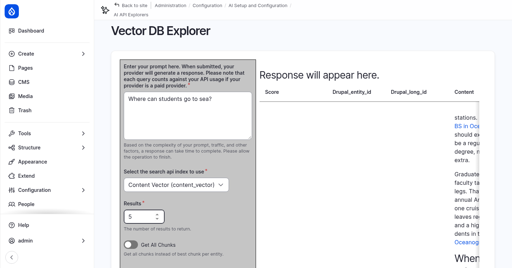

### The RAG tool in the Tools Explorer

In step 1 you tested tools in the
[Tools Explorer](https://drupal-ai-workshop.ddev.site/admin/config/ai/explorers/tools_explorer).
Choose **RAG/Vector Search (ai_search)** and enter `content_vector` as **index** and
`Where can students go to sea?` as **search_string**. Click **Run Function**.

The result is exactly the text the agent receives when it searches: the best chunks,
each with its page URL and title. **min_score** (default `0.5`) drops chunks that are
not similar enough.

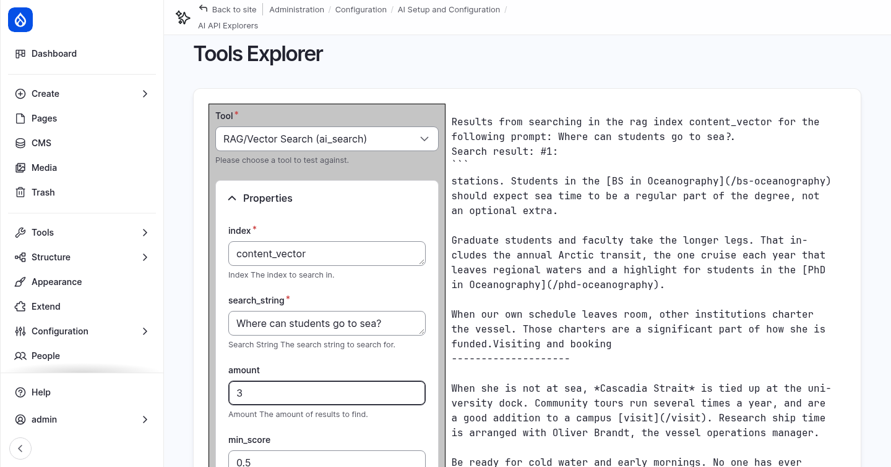

## 6. The agent and the AI Answers settings

### The Content Search Agent

**Module:** AI Agents (`ai_agents`).

Edit the [Content Search Agent](https://drupal-ai-workshop.ddev.site/admin/config/ai/tools-automation/agents/content_search_agent/edit/form).
Its instructions tell it to answer only from the retrieved content, to say so when the
content has no answer, and to cite its sources inline. Its only tool is **RAG/Vector
Search**.

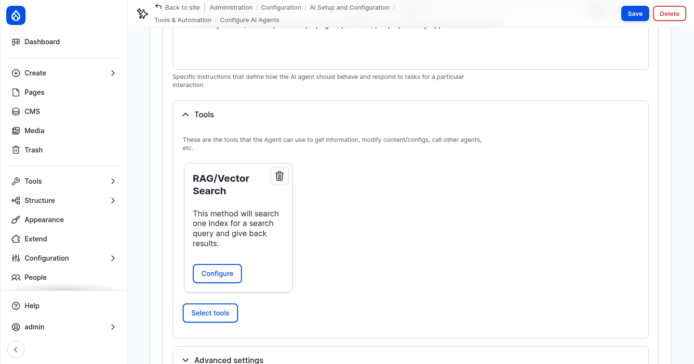

Click **Configure** on the tool and open **Property setup**. The property **index** is
set to **Force value** `content_vector`. The AI decides what to search for, but it
cannot search any other index. This is the property setup you saw in step 1.

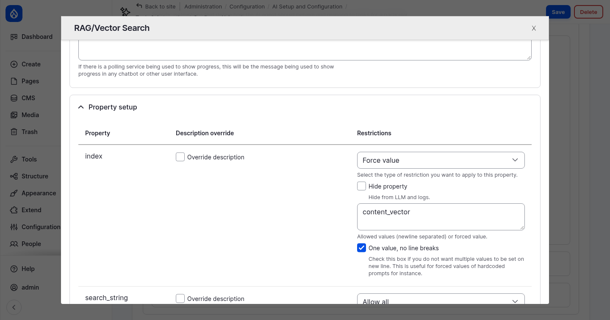

### AI Answers settings

**Module:** AI Answers (`ai_answers`).

Go to **Configuration › AI Setup and Configuration ›**
[AI Answers agents](https://drupal-ai-workshop.ddev.site/admin/config/ai/ai-answers/agents)
and edit the Content Search Agent:

| Setting | What it does |
|---|---|
| Provide answers with this agent | Makes the agent available for the AI Answers blocks. The agent needs a RAG tool with a forced index. |
| AI provider | *Default* uses the default model for *Chat with tools*. |
| Reference view mode | How each source page is shown in the list of sources. Change it to **Card**, which is more compact than *Teaser*. |
| No-answer message | Shown when nothing relevant is found. |
| Accept feedback | Shows thumbs up and down under each answer. The feedback is logged. |
| Conversation retention | How long a conversation is kept for follow-up questions (3600 seconds). |

Click **Save**.

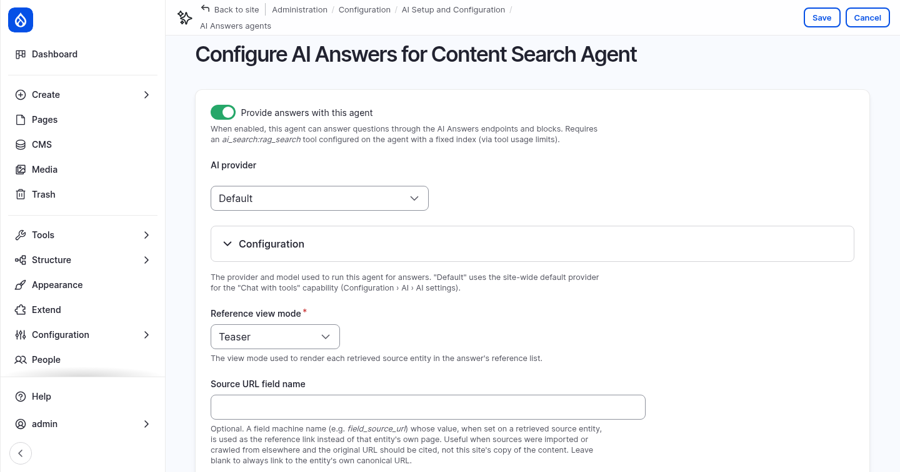

### Permission

Visitors need the permission **Use AI Answers**. Give it to *Anonymous user* and
*Authenticated user* on the
[AI Answers permissions](https://drupal-ai-workshop.ddev.site/admin/people/permissions/module/ai_answers)
page, or with:

```bash
ddev drush role:perm:add anonymous 'use ai answers'
ddev drush role:perm:add authenticated 'use ai answers'
```

Without it, every question fails with "Could not reach the answer service".

## 7. Build the Ask Northmoor page

### Create the page

1. Go to **Content › Add content ›**
   [Utility page](https://drupal-ai-workshop.ddev.site/node/add/page).
2. **Title:** `Ask Northmoor`.
3. **Content:** a short introduction, for example: *Ask a question about Northmoor
   University: programs, admissions, research, our facilities or visiting the campus.
   The answer is written by AI from the pages on this website, and the sources are
   listed below the answer.*
4. **Description:** click **Generate description**, the button from step 2.
5. **URL alias:** uncheck **Generate automatic URL alias** and enter `/ask`.
6. **Change to:** **Published**. New pages are drafts by default.
7. Click **Save**.

### Place the blocks

The AI Answers module provides three blocks that work together:

| Block | What it shows |
|---|---|
| AI Answers: Question | The question field, and optional suggested questions. |
| AI Answers: Answer | The answer, follow-up questions and feedback. It decides which agent answers. |
| AI Answers: Sources | The source pages of the answer. |

Go to **Structure ›** [Block layout](https://drupal-ai-workshop.ddev.site/admin/structure/block)
(Olivero) and place these blocks in the **Content** region. Place the Answer block first,
because the other two point to it.

1. **AI Answers: Answer**
   - **Display title:** off
   - **AI Agent:** *Content Search Agent*
   - **Show references:** off, because the Sources block shows them
   - **Visibility › Pages:** `/ask`

   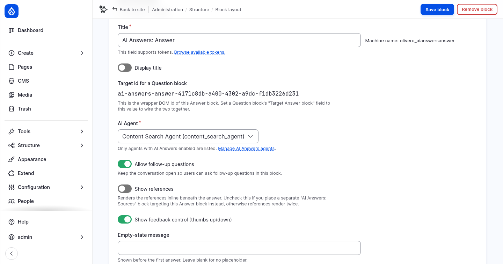

2. **AI Answers: Question**
   - **Display title:** off
   - **Target Answer block:** *AI Answers: Answer (content)*
   - **Placeholder:** `Ask anything about Northmoor`
   - **Suggested questions**, one per line:

     ```
     Which master's programs can I study?
     How do I apply?
     What is the R/V Cascadia Strait used for?
     ```

   - **Visibility › Pages:** `/ask`

   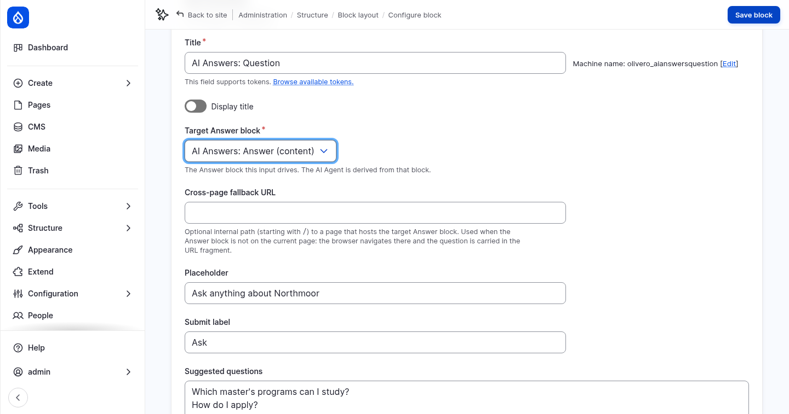

3. **AI Answers: Sources**
   - **Display title:** off
   - **Target Answer block:** *AI Answers: Answer (content)*
   - **Visibility › Pages:** `/ask`

4. Put the blocks in order in the Content region: *Main page content*, Question,
   Answer, Sources. Drag them, or click **Show row weights** and set the weights. Click
   **Save blocks**.

Then add a question field to every page, in the footer:

5. Place **AI Answers: Question** in the **Footer Top** region:
   - **Title:** `Ask Northmoor`, with **Display title** on
   - **Target Answer block:** *AI Answers: Answer (content)*
   - **Cross-page fallback URL:** `/ask`. The Answer block is not on the other pages, so
     the browser goes to `/ask` and takes the question along.
   - **Visibility › Pages:** `/ask`, with **Hide for the listed pages**

   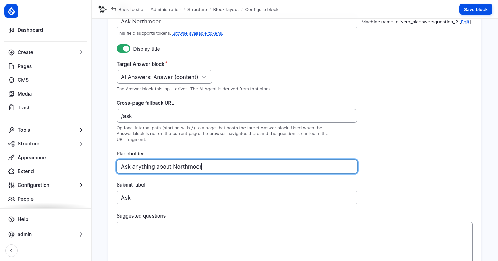

## 8. Ask questions

Log out, or use a private browser window, and open
[Ask Northmoor](https://drupal-ai-workshop.ddev.site/ask). Click a suggested question or
type your own:

- *Which master's programs can I study?*
- *How do I apply?*
- *What is the R/V Cascadia Strait used for?*
- *Can I study part-time?*
- an off-topic question, such as *Who won the football world cup in 2014?* The agent
  says that its sources do not cover it.

The answer cites its sources as [1], [2] and so on. The sources are listed below the
answer, with the similarity score. Ask a follow-up question in the field under the
answer.

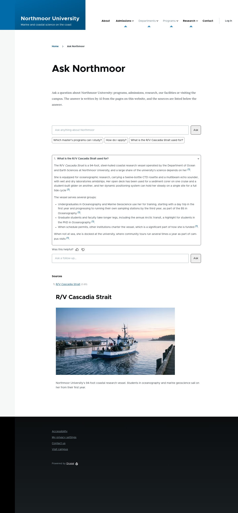

Try the footer field on another page, for example
[About Northmoor](https://drupal-ai-workshop.ddev.site/about). It takes you to `/ask`
with the answer.

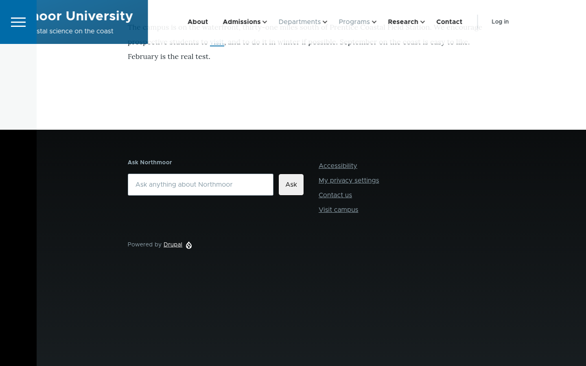

### Follow an answer in the AI logs

**Module:** AI Logging (`ai_logging`).

The **Threads** tab of the AI logs groups the requests that belong together. It
recognizes them by the beginning of their tags. The chatbot from step 1 tags its requests
with `ai_assistant_thread_…`, but AI Answers runs its agent without a thread. Each answer
is tagged with `ai_agents_runner_…` instead, so it does not appear under Threads yet.

1. Open the [AI Logging Settings](https://drupal-ai-workshop.ddev.site/admin/config/ai/logging/settings)
   and open **Conversation threads**.
2. Add a new line `ai_agents_runner_` to **Thread tag prefixes**, and click **Save
   configuration**.
3. Open [AI Logs › Threads](https://drupal-ai-workshop.ddev.site/admin/config/ai/logging/threads)
   as admin. Every answer is now a thread, with the question, the number of requests and
   the tokens used. This also applies to answers you asked before the change.

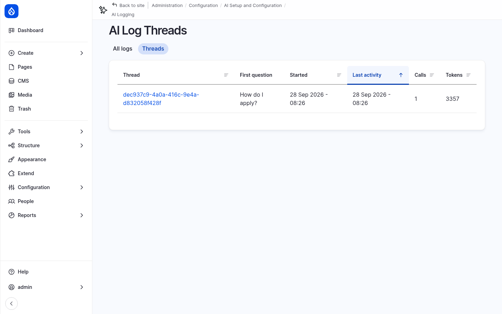

Open a thread to see its requests: the agent's call to the RAG search tool, and the
answer written from the retrieved chunks. The embedding of the question is a separate
request with the tag `embeddings`, in the list of all logs.

### A note on data

Questions are sent to the AI provider, together with the retrieved page content. AI
Answers keeps each conversation for one hour, for follow-up questions, and logs the
feedback. On a real site, mention this in your privacy notice.

## More to try

- **Stricter matching:** on the Content Search Agent, open the RAG tool's **Property
  setup** and force **min_score** to `0.7`. Ask a vague question and compare.
- **Guardrails:** attach the *Workshop security* guardrail set from step 1 to the agent
  and try a prompt injection in the question field.
- **Chunk size:** change the chunk size on the server to `150`, index again
  (`ddev drush search-api:clear content_vector && ddev drush search-api:index content_vector`)
  and compare the answers.
- **Watch indexing:** change a page, save it, and search for the new text in the Vector
  DB Explorer. Pages are indexed when they are saved.

## Checkpoint

You now have:

- the Northmoor pages indexed as vectors in PostgreSQL
- search by meaning in the Vector DB Explorer and the RAG tool
- an **Ask Northmoor** page at `/ask` that answers questions with sources, for all
  visitors
- a question field in the footer of every page

If something does not work, reset your site to the end of this step:

```bash
git checkout 03_ai_search
ddev catch-up
```

`ddev catch-up` also indexes the content again, because the vectors are stored in
PostgreSQL and not in the database dump.
