# Step 4: AI Content Review

**Goal:** an AI reviewer checks pages against the Northmoor house style. It gives each page
a score, quotes every problem it finds, and suggests corrections. Editors decide which
suggestions to follow, correct the text and review it again.

**Before you start:** this step adds new Composer packages. Check out the branch of this
step and install them:

```bash
git checkout 04_ai_content_review
ddev composer install
ddev drush cache:rebuild
```

Then:

- to do this step yourself, continue with your site from [step 3](03_ai_search.md);
- to skip to the result of this step, run `ddev catch-up`.

## 1. How AI Content Review works

- A **review rule** says which content is reviewed (here: all Utility pages) and against
  which **criteria**.
- A **criterion** is one editorial check with a written rubric, scored examples and a
  pass and a warning threshold. This step uses one criterion: **Grammar &
  Conventions**.
- An **AI agent** is the judge. It reads the page and the rubric, and reports a score, an
  explanation and suggestions through a tool.
- Every run is stored as a **review record**, with the revision of the page it reviewed.
  Suggestions are stored with it.
- Reviews run **on demand**: an editor clicks a button, or reviews are queued in bulk. They
  never run automatically when a page is saved.

Two pages of the sample site contain deliberate style errors for this step: [Visit
campus](https://drupal-ai-workshop.ddev.site/visit) and [Tuition and financial
aid](https://drupal-ai-workshop.ddev.site/tuition-and-aid). Look at them first: they have
title-case headings, British spelling, dash ranges, "click here" links and exclamation
marks.

## 2. Apply the recipe

There is no public recipe for AI Content Review yet. The workshop recipe
[recipes/workshop_ai_content_review](../recipes/workshop_ai_content_review/) installs the
modules and adds the rule and the agent.

```bash
ddev drush recipe ../recipes/workshop_ai_content_review
```

| Module | Project | What it does |
|---|---|---|
| AI Content Review (`ai_content_review`) | [AI Content Review](https://www.drupal.org/project/ai_content_review) | Review rules, criteria, review records, suggestions and the review UI. |
| AI Agents (`ai_agents`) | [AI Agents](https://www.drupal.org/project/ai_agents) | The judge agent. Already installed in step 1. |
| Entity (`entity`) | [Entity API](https://www.drupal.org/project/entity) | Required by AI Content Review. |
| Token (`token`), Token Entity Render (`token_entity_render`) | [Token](https://www.drupal.org/project/token), [Token Entity Render](https://www.drupal.org/project/token_entity_render) | The token `[node:render:full]`, which passes the rendered page to the agent. Without it, the agent sees no content. |

## 3. The review rule

Go to **Configuration › AI Setup and Configuration ›**
[Review Rules](https://drupal-ai-workshop.ddev.site/admin/config/ai/content-review/rules)
and edit **Editorial review**.

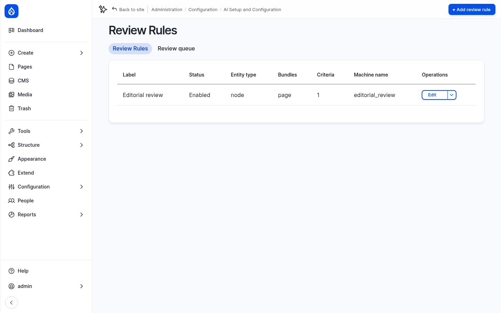

The rule reviews **Content** of the subtype **Utility page**. It has one criterion,
**Grammar & Conventions**.

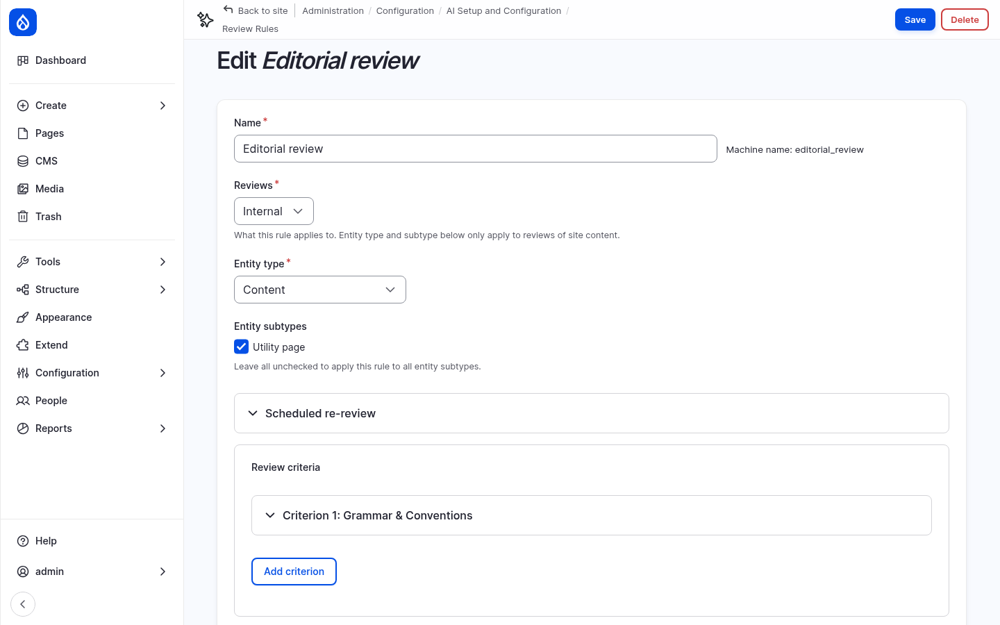

Open **Criterion 1: Grammar & Conventions**:

- **Criterion type:** *Agent-based criterion*. An AI agent does the review.
- **AI agent:** *Content Review*.
- **AI provider:** *amazee.ai – claude-4-5-haiku*. The workshop uses a fast model here:
  a review with the default chat model of the amazee.ai trial takes longer than the
  30-second request limit of the provider. If you use OpenAI or Anthropic, choose one of
  their models.

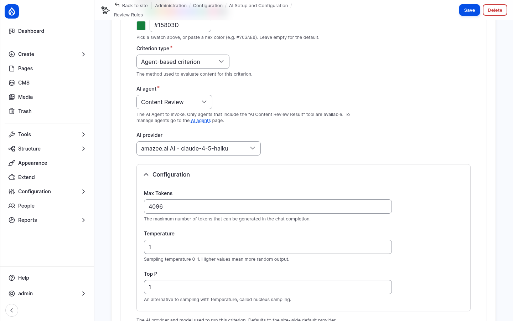

- **Execution mode:** *Direct* runs the review in one request. *Polling* runs it step by
  step from the browser, for long reviews.
- **Guidelines & rules:** the rubric the AI reads. It has these parts:
  - **Method:** start at 100, subtract 5 for each error, and report the arithmetic.
  - **Two counting rules:** each rule counts at most two errors, and an error only counts
    if the AI can quote the text and name the rule.
  - **A closed list of 10 house-style rules:** sentence-case headings, dates such as
    November 19, 2026, times such as 9 a.m., ranges with "to" instead of a dash,
    American spelling, link text that stands alone, at most two em dashes, no
    exclamation marks or ampersands, course codes, and no sentence over 40 words.
  - **A list of things that are not errors,** because they caused false findings in
    tests.
  - **How to write suggestions:** a short rationale for an editor, in plain words.

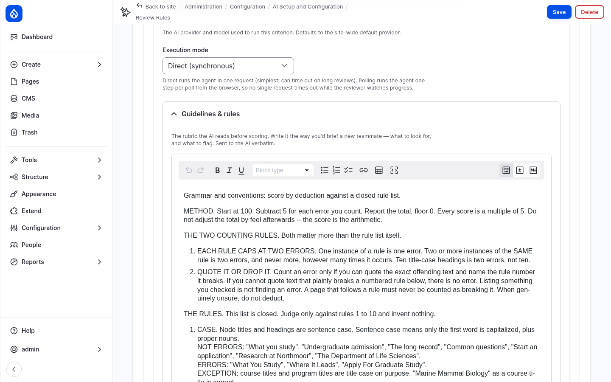

- **Scoring thresholds:** below 85 fails, 85 to 89 warns, 90 and above passes.

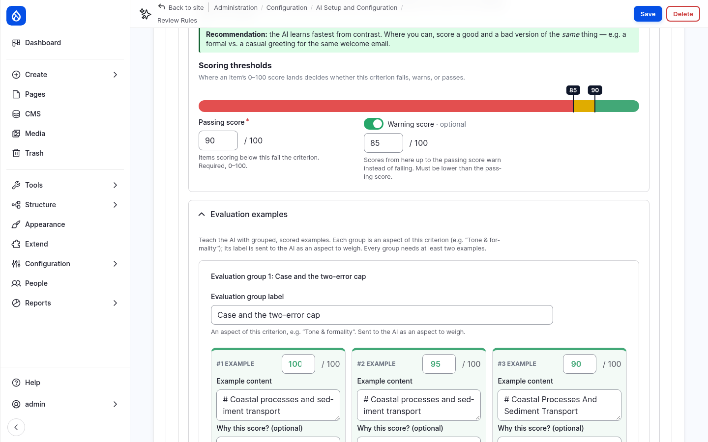

- **Evaluation examples:** short texts with their correct score and the reason. They
  calibrate the AI, so that it scores the way the editorial team would. Each group is an
  aspect of the criterion, such as *Case and the two-error cap*.

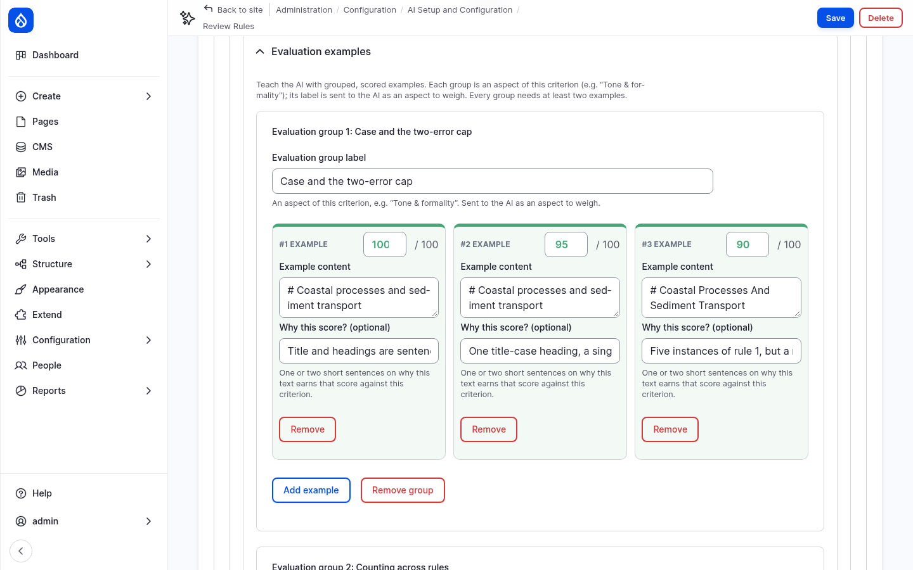

## 4. The Content Review agent

**Module:** AI Agents (`ai_agents`).

Edit the [Content Review agent](https://drupal-ai-workshop.ddev.site/admin/config/ai/tools-automation/agents/content_review/edit/form).
Its instructions contain the content between `--- BEGIN CONTENT ---` and
`--- END CONTENT ---`, as the tokens `[node:title]` and `[node:render:full]`. The rubric
and the examples of the criterion are sent in the task message.

The agent has two tools from AI Content Review:

- **AI Content Review Result** reports the score, severity, explanation and suggestions.
  It is set to **Require usage** and **Return directly**: the agent must call it, and its
  result is the answer. You saw these tool settings in step 1.
- **AI Content Review Suggestion Item** describes the format of a suggestion. The agent
  does not call it directly.

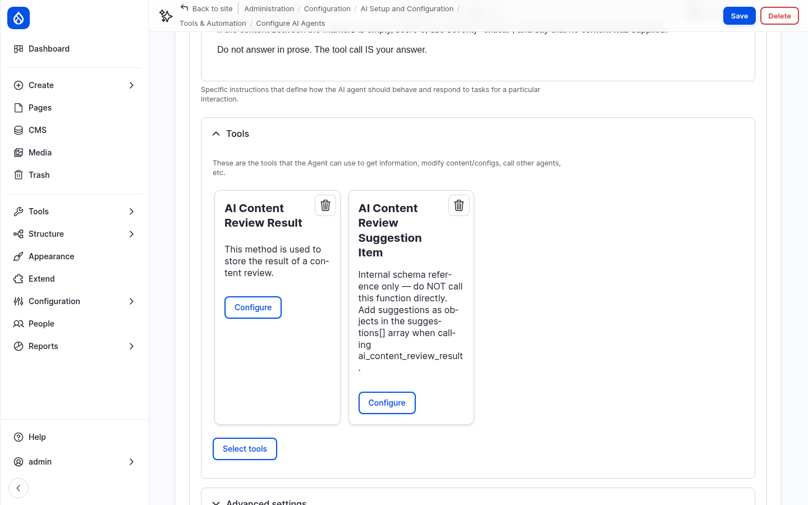

## 5. Permissions

Administrators have every permission. To let content editors run reviews, give the
*Content editor* role the permissions **Run AI content reviews**, **View AI review
records** and **View AI review records history** on the
[AI Content Review permissions](https://drupal-ai-workshop.ddev.site/admin/people/permissions/module/ai_content_review)
page, or with:

```bash
ddev drush role:perm:add content_editor 'run reviews'
ddev drush role:perm:add content_editor 'view review records'
ddev drush role:perm:add content_editor 'view review history'
```

## 6. Review a page

1. Open [Visit campus](https://drupal-ai-workshop.ddev.site/visit) and click the **AI
   Review** tab.
2. Click **Review**. After about 10 seconds, the result appears: a score of about
   **60%**, grade **Fail**.

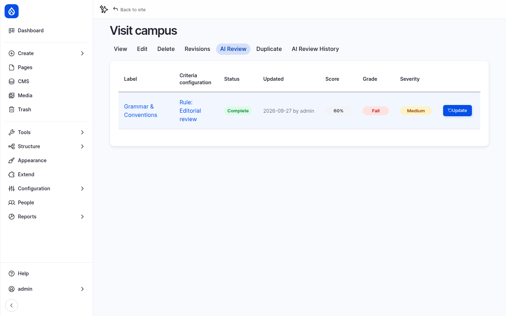

3. Click **Edit**. The sidebar of the edit form has a **Content Review** panel with the
   same result. Click **Grammar & Conventions** to open the details.

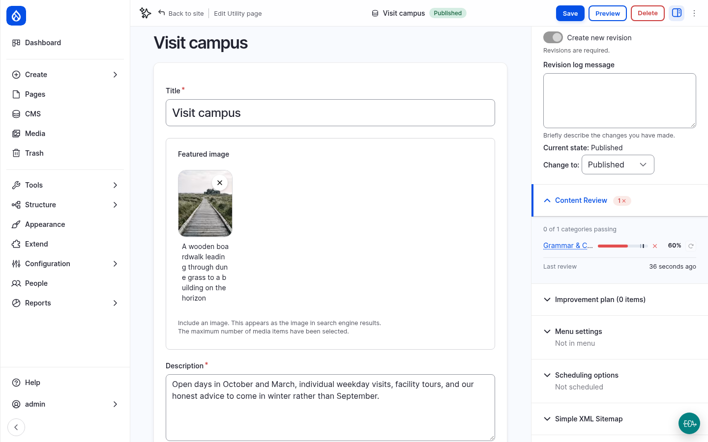

The explanation counts every error, quotes the text, names the rule and shows the
arithmetic, for example *Rule 2 (Dates): "17 October 2026" should be October 17, 2026*.
Below it are the **recommendations**. Each one has a new value and a short rationale.
**Show proposed change** compares the current and the suggested value.

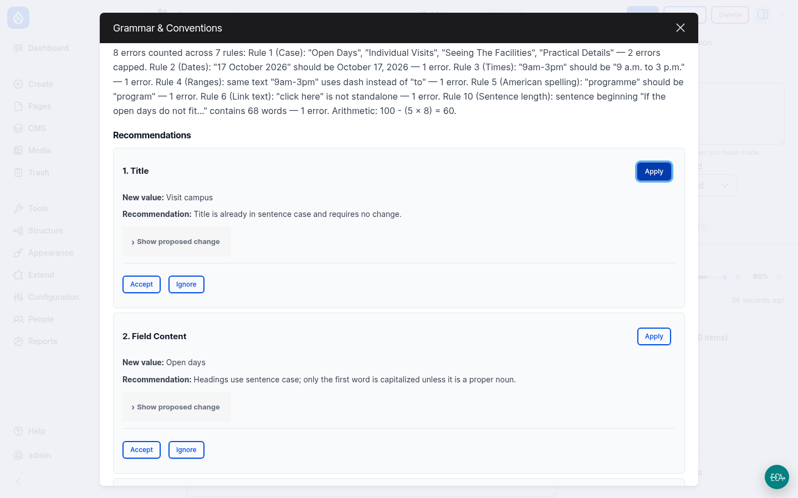

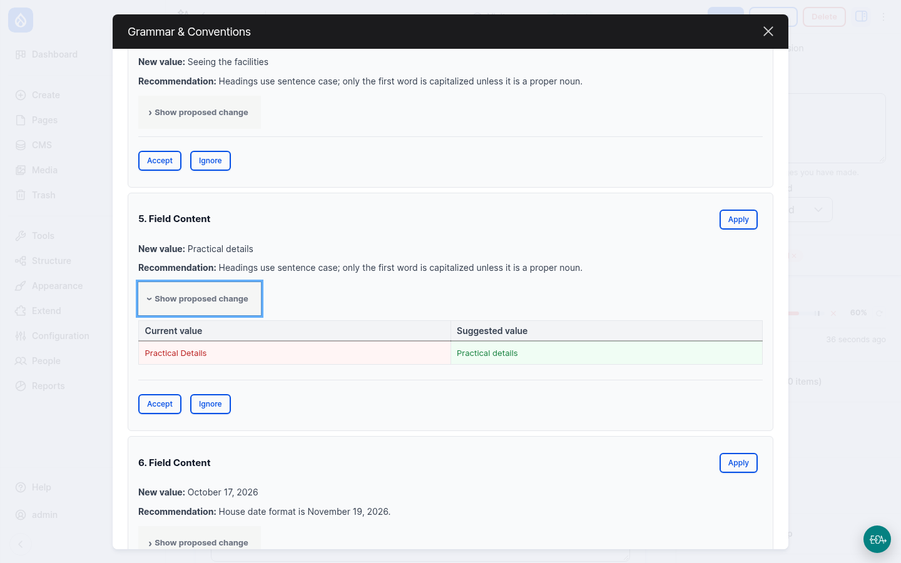

> **Do not click Apply.** In the current version of AI Content Review (1.0.0-alpha3),
> *Apply* replaces the **whole field** with the suggested value. The suggestions here
> are short phrases, so applying one replaces the entire page text with a few words, and
> the page is saved immediately. If it happens, restore the previous revision on the
> **Revisions** tab, or run `ddev catch-up`.
>
> This is a known bug, see issue
> [#3585854](https://git.drupalcode.org/project/ai_content_review/-/work_items/3585854).

## 7. Plan and correct

1. For each recommendation, click **Accept** or **Ignore**. Not every suggestion is
   right. For example, the reviewer may suggest a "change" that keeps the text the same.
   The editor decides.
2. Close the dialog and open **Improvement plan** in the sidebar. It lists the accepted
   suggestions as tasks that you check off as you correct the text.

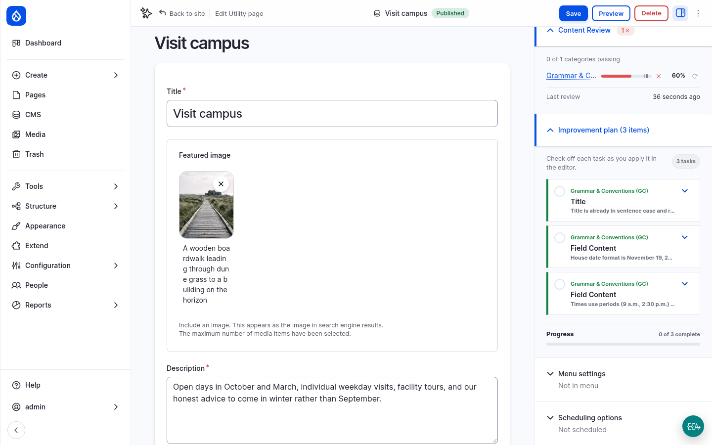

3. Correct the text in **Content** yourself: headings in sentence case, the date and
   time formats, *program* and *center*, no exclamation mark or ampersand, a link text
   instead of "click here", and the very long sentence split in two.
4. Save the page.
5. Go back to the **AI Review** tab and click **Update**. The review runs on the new
   revision. With the errors corrected, the page passes.

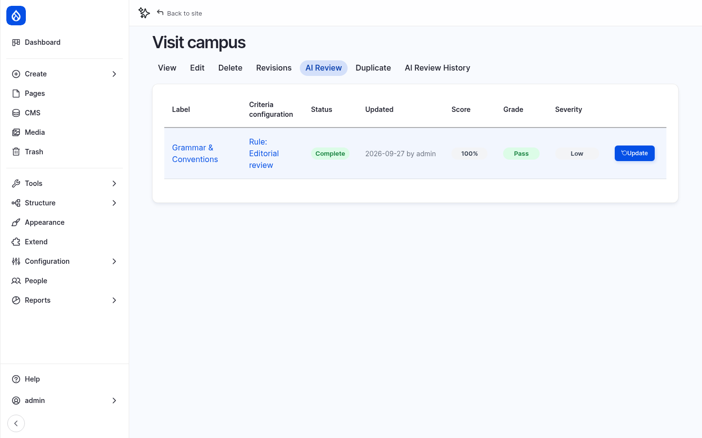

The **AI Review History** tab lists every review of the page, with its revision and
score.

## 8. Compare and get an overview

- Review [Tuition and financial aid](https://drupal-ai-workshop.ddev.site/tuition-and-aid),
  the second page with errors. It also fails.
- Review a page without deliberate errors, for example
  [About Northmoor](https://drupal-ai-workshop.ddev.site/about). It passes, or comes
  close.
- Go to **Content ›** [AI content review](https://drupal-ai-workshop.ddev.site/admin/content/ai-review).
  It lists all pages with their review results, and can be filtered by outcome and
  criterion. The bulk action **Queue AI review** reviews several pages at once, on cron. It
  needs the permission *Queue AI reviews in bulk*.

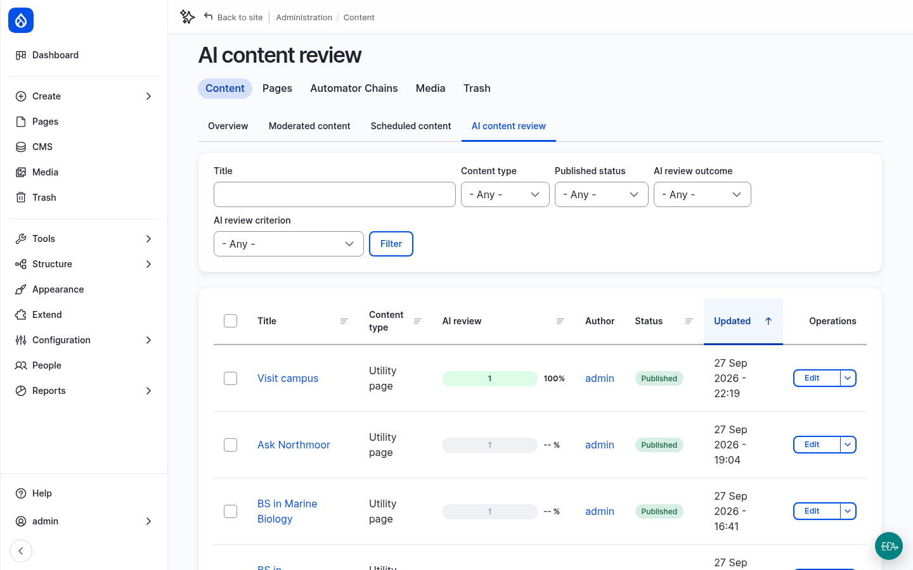

Every review is an AI request. Open
[AI Logs](https://drupal-ai-workshop.ddev.site/admin/config/ai/logging/collection) to see
the prompt the agent received and the tool call it returned.

## More to try

- **Your own house rule:** add a rule 11 to the criterion's **Guidelines & rules**, for
  example *Northmoor University is never abbreviated as NU*, and save the rule. Earlier
  results no longer count, because the criterion has changed. The button on the AI Review
  tab changes to **Update**.
- **Stricter thresholds:** set the passing score to 95 and review About Northmoor again.
- **A second criterion:** click **Add criterion** and write a short *Readability*
  criterion, for example: *Judge how easily a general reader gets through this content:
  short sentences, common words, one idea per sentence.*

## Checkpoint

You now have:

- the rule **Editorial review** with the criterion **Grammar & Conventions** for all
  Utility pages
- a reviewed and corrected *Visit campus* page that passes
- an overview of the review results of all pages

If something does not work, reset your site to the end of this step:

```bash
git checkout 04_ai_content_review
ddev catch-up
```
